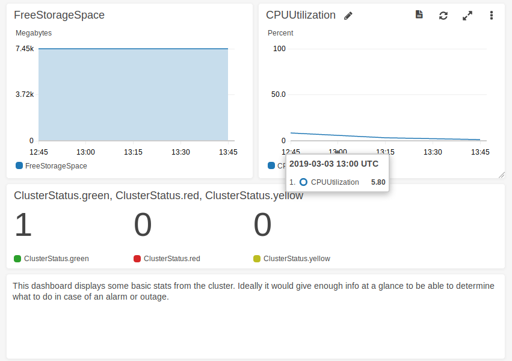

> ⚠️ This project was created as part of a technical test as part of a job interview. It has never ran in production, and my ability to support this project will be limited since I'm not currently using it myself.

# terraform-aws-elasticsearch


This is a terraform module to easily provision an AWS ElasticSearch domain inside a VPC for smaller clusters. It is structured into three separate modules.

- `aws-elasticsearch` is the main module which provisions the elasticsearch domain inside your VPC. This is the basic requirement.
- `aws-elasticsearch-cloudwatch-dashboard` which adds a simple CloudWatch dashboard to your elasticsearch domain.
- `aws-elasticsearch-cloudwatch-sns-alerting` which adds a single alarm to send an email if your elasticsearch domain status is no longer green. **Currently this does not work though :(**

## Usage

Here's some code by example, just fill in the gaps.

```t
module "aws-elasticsearch" {
  # Replace the version number at the end to use a newer (or older) version of the module.
  source = "git::git@github.com:Tethik/terraform-aws-elasticsearch.git//aws-elasticsearch?ref=0.1.1"

  domain     = "" # The domain name of the ES cluster
  vpc_id     = "" # The VPC to run the ES cluster inside. This will limit the access to only hosts inside that VPC.
  subnet_ids = [""] # The subnet(s) inside the VPC to place the cluster in.
  elasticsearch_version = "" # Defaults to 6.4
  elasticsearch_instance_type = "" # Defaults to t2.small.elasticsearch
  elasticsearch_instance_count = "" # Defaults to 1
  elasticsearch_volume_size = "" # Size in GB of the disk allocated to the ES Instance(s). Defaults to 10GB
}

module "aws-elasticsearch-cloudwatch-dashboard" {
  source = "git::git@github.com:Tethik/terraform-aws-elasticsearch.git//aws-elasticsearch-cloudwatch-dashboard?ref=0.1.1"

  domain = "" # The domain name of the ES cluster. Use the same as above.
}

module "aws-elasticsearch-cloudwatch-sns-alerting" {
  source = "git::git@github.com:Tethik/terraform-aws-elasticsearch.git//aws-elasticsearch-cloudwatch-sns-alerting?ref=0.1.1"

  domain       = "" # The domain name of the ES cluster. Use the same as above.
  alarms_email = "" # The email to send alarms to
}
```

## Testing

In the top level of this repository I have provided a `sample.tf` file which showcases how to use these modules.
Simply `terraform plan/apply` with your AWS credentials to try it out.

By default the sample will set an [access policy](https://github.com/Tethik/terraform-aws-elasticsearch/blob/master/sample.tf#L45-L63) to allow for anything coming from AWS (inside the VPC).

Use an EC2 instance inside the VPC as a proxy, using SSH to tunnel the connection. E.g.

```
ssh <user@ip> -N -L 9200:vpc-example-n2mczfaqfo25w65nd4afx23yim.eu-central-1.es.amazonaws.com:443
```

Now you should be able to access the cluster on `https://localhost:9200` and kibana on `https://localhost:9200/_plugin/kibana`

## Monitoring

Included is a CloudWatch dashboard with some minimal stats displayed. You'll find it on your AWS account under `CloudWatch -> Dashboards`.


By default the AWS ES domains already publish metrics to CloudWatch. These can then be used elsewhere too.
https://docs.aws.amazon.com/elasticsearch-service/latest/developerguide/es-managedomains.html#es-managedomains-cloudwatchmetrics

## Further Improvements

These are some improvements I would make before considering this module production ready. In the interest of time
I won't delve too much into them, but I want to note them down to show my awareness of the problems that exist.

## Scaling

I did not test anything besides the very smallest instance size to save costs. Not sure how this would work for larger clusters.
There's a lot of configuration available that you may want to enable if you need to run a larger cluster that I do not expose here (e.g. master nodes?).

### Longer term storage

What happens when the cluster runs out of space? This could eventually happen, it will definitely happen
if you log e.g. requests.

Ideally you would not have to keep that data. In which case you could just rotate out old data.

Otherwise you might want to also ship the raw logs somewhere, e.g. S3. Not sure how this would work.

### Version Upgrades

Not sure how upgrades would work, but there should be a strategy and it should be tested. i.e. How do you upgrade to a newer
version of ES without losing data? For now I've set up some basic versioning on the project using [git flow](https://github.com/nvie/gitflow). I would maintain it using [semantic versioning](https://semver.org/) to organize the version numbers and communicate breaking changes.

### Request Signing

By default AWS ElasticSearch requires any requests to it to be signed by an IAM credential that has the correct authorization.
I still need to figure out how would this actually work in practice with Logstash/Beats.

### Better dashboard/alarms based on ES Domain Knowledge

I don't have much experience using ES long term, and most of my experience has been as a developer. I don't know
which metrics are important to keep track of. Therefore I would have liked to invest more time into reading up on
this, or asking someone more knowledgeable on hosting ES clusters as to what is important to keep track of.

### Automated Testing

This is code after all. We could code tests for it to e.g. try connecting to the cluster and logging some data, or ensuring that the cloudwatch alarm works. This would be helpful during development.

### Multiple Subnets

I don't think it currently works to give the module multiple subnets. It would have been nice to only specify the VPC. This might
have to do with the fact that I only run a single instance though. Maybe if I ran more AWS would be smart enough to distribute them
accross the different subnets.

## TODO

My own little todolist before I sign off on this task:

1. Fix Alerting

## Sources / References

VPC ES setup
https://docs.aws.amazon.com/elasticsearch-service/latest/developerguide/es-vpc.html#es-prerequisites-vpc-endpoints

ES CloudWatch
https://docs.aws.amazon.com/elasticsearch-service/latest/developerguide/es-managedomains.html#es-managedomains-cloudwatchmetrics

Alerting + Monitoring example, especially helpful for the email part.
https://stephenmann.io/post/setting-up-monitoring-and-alerting-on-amazon-aws-with-terraform/
